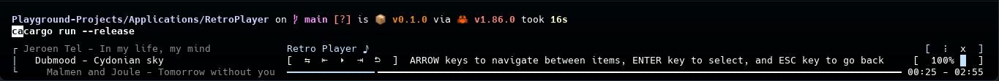

# Retro Player

A TUI audio playing application made in Rust.

# Motive

After creating my very own TUI library called [Retro Engine](https://github.com/The-Nice-One/PlaygroundProjects/tree/main/Libraries/RetroEngine), I wanted to create a simple audio player in order to showcase its features. I have also wanted to built a TUI for a very long time, and this was a perfect opportunity to do so.

# Features

* Configuration file (`Configuration.toml`) for all settings.
* Audio playback control (shuffle, previous, play/pause, next, restart, volume).
* Simple to understand interface and adaptive layout based on terminal width.
* Keyboard input for all interactions.

# Preview



# Usage

This project features a Rust binary application, which can be bullt and ran with the following pre-requisites:

* [Rust toolchain](https://www.rust-lang.org/tools/install)

Once you have the Rust toolchain installed, you can `cd` into this project and run the project via Cargo:

```bash
cargo build --release

cargo run --release
```

# License

As with all other projects in this playground, the license is CC BY-NC.
