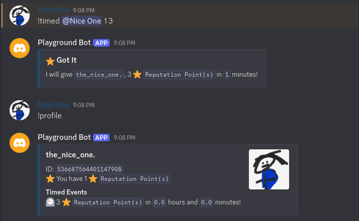

# Rep Bot
A simple discord bot bringing a point system to your server.

# Motive
Initially this project was created to manage an event in which so called "Event Tokens" were given to users as rewards. However, since then I have decided to improve on it, making it fully customizable for your own servers. Providing a way to give out points to your members for contributions, chatting, helping, or for any other reason you can think of.

# Features
* A fully customizable point system; change the name of your "Point", set your "Point" emoji, and set who can give points to others.
* A scheduling system; set a time to give points to a user.
* A fully fledged out logging system; keep track of who gave points to whom, when, and how much.
* Profile and leaderboards; view the top users and see their points.
* Customizable prefix for the bot.

# Preview


# Usage
This project contains a single [src/main.py](src/main.py) file which can be ran indenpently so long as your have [discord.py](https://pypi.org/project/discord.py/) installed. However, you may wish to create a custom venv to install the dependencies and run the project from there. In which case you will need to install the following:

* [Python 3.x](https://www.python.org/downloads/)

Once you have Python installed change your present working directory to the project's root directory and run the following commands to execute the [src/main.py](src/main.py) file:

```bash
python -m venv .venv
source .venv/bin/activate

pip install .
run <replace with your bot token, remove the < and > aswell>
```

# License
As with all other projects in this playground, the license is CC BY-NC.
