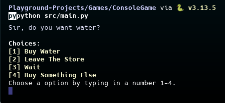

# Sir, do you want water?
A simple Python text based game in which you buy water... nothing more.

# Motive
This is one of my earlist Python projects in which I explored creating a game loop, and experimented with threading to simutainlisly run code which is used for user input in some parts of the game.

# Features
* Text-based game with multiple options for the user.
* Somewhat more complex interactions which allow for input.
* Simple Formatting for colored text and more styled output.

# Preview


# Usage
This project contains a single [src/main.py](src/main.py) file which can be ran indenpently and has no package dependencies. This project also leaves no artifacts and as a result you may wish to run this without an environment in order to facilitate usage. In which case you will need to install the following:

* [Python 3.x](https://www.python.org/downloads/)

Once you have Python installed change your present working directory to the project's root directory and run the following command to execute the [src/main.py](src/main.py) file:

```bash
python src/main.py
```

## License
As with all other projects in this playground, the license is CC BY-NC.
