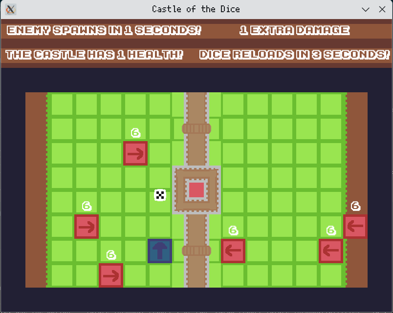

# Castle of the Dice

A 2D tile-based shooter game made with Rust and [Emerald](https://crates.io/crates/emerald).

# Motive

This project was my submission fot the GMTK Game Jam 2022. I built this game with the goal of exploring a script-based game engine. For the purpose of this playground, I have also organized the code, used `include_bytes!()` to allow packing all assets into a single binary, and have included an icon set.

# Features

* Tile based movement and collisions.
* Sounds and some simple UI.
* Enemy Spawning

# Preview



# Usage

This project contains a Rust project, to build and run you will need the following pre-requisites:

* [Rust toolchain](https://www.rust-lang.org/tools/install)

Once you have the Rust programming language installed along with Cargo, you can build and run the game by running the following commands:

``` bash
cargo build --release
cargo run --release
```

# License

As with all other projects in this playground, the license is CC BY-NC.
