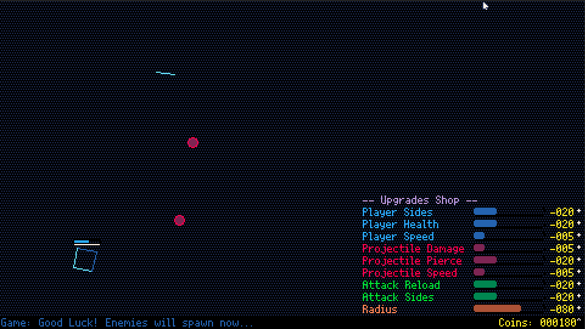

# Loop Blaster

A 2D shooter game with a unique mechanic, built with Picotron.

# Motive

This game was my submission for the GMTK Game Jam 2025. I used this opportunity to create my first game in Picotron and my first project with the Lua programming language.

# Features

* 8-directional normalized player movement.
* Scaled enemy spawning and difficulty algorithm based on score, and other factors.
* Shop with multiple player upgrades (includes a small Button UI library).
* Rectangle bounded collision detection.
* 2 different enemy drops and extra features to explore!

# Preivew



# Usage

This project contains a `.p64` file which can be loaded given you have the following prerequisites:

* [Picotron](https://www.lexaloffle.com/picotron.php#getpicotron)

Once you have picotron installed you may copy the [loop_blaster.p64](loop_blaster.p64) file to your picotron application folder load the file via:

``` bash
# Run this command within the Picotron terminal
load loopblaster.p64
# You can then press CTRL+R to run the game
```

# License

As with all other projects in this playground, the license is CC BY-NC.
