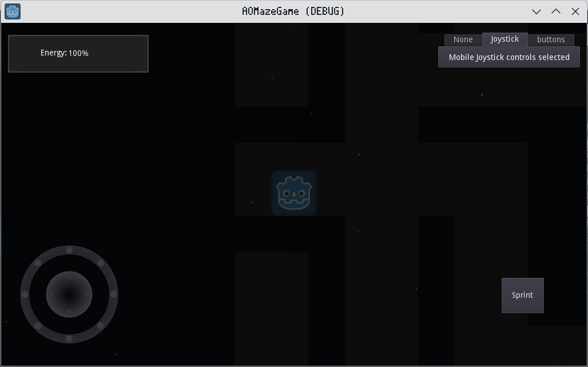

# Maze Game
A maze game with multiple control methods created in the Godot game engine.

# Motive
This game was created during my Game Programming class in 10th grade of high school. The objective was to simply create a maze game, and we had full creative liberty. I created multiple control modes, on-screen effects with particles and various lights, and a timer for a simple scoring system.

# Features
* Multiple control methods for mobile and desktop (joystick, directional buttons, keyboard).
* Multiple lighting effects (using Light2D and AnimationPlayer nodes).
* Simple UI for choosing control method, displaying sprint energy, and timer.

# Preview


# Usage
This project holds a fully contained Godot project. To run it, you will need the following:

* [Godot 3.x](https://godotengine.org/download/3.x/)

Once you have Godot installed, change your present working directory to the project's root directory and run the following commands to execute the [scenes/Main.tscn](scenes/Main.tscn) file:

```bash
godot
```

You may also open the Godot editor and import the project via the zip file or its [`project.godot`](./project.godot) file.

# License
As with all other projects in this playground, the license is CC BY-NC.
