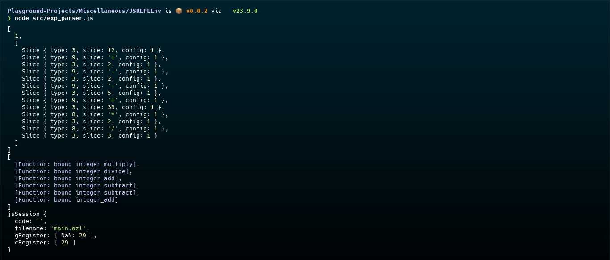

# JS-REPL-Env
A javascript prototype for my programming language.

# Motive
This project was built exploring parser design and simple compilation into javascript function calls-which run on a deticated virtual session. It was created to add support for my programming language in the browser, allowing it to be used for code snippets, and embeding.

# Features
* Simple expression parsing such as `1 + 2 * 3` with order of operations. (Found in [src/exp_parser.js](src/exp_parser.js))
* A runtime environment with a set of simple instructions, and memory registers. (Found in [src/interpreter.js](src/interpreter.js))
* Experimental unfinished compiler for simple source code. (Found in [src/compiler.ts](src/compiler.ts))
* A simple error builder. (Found in [src/universal_error_system.js](src/universal_error_system.js))

# Preview


# Usage
This project contains multiple files, with some being used as dependencies and some as indepedent files. You will need the following prerequisites to run any file in this project:

* [Node.js](https://nodejs.org/en/download) (or any js runtime including the browser)

Assuming you have Node.js installed, you can use the following command to run the [src/exp_parser.js](src/exp_parser.js) file per say:

```bash
node src/exp_parser.js
```

# License
As with all other projects in this playground, the license is CC BY-NC.
