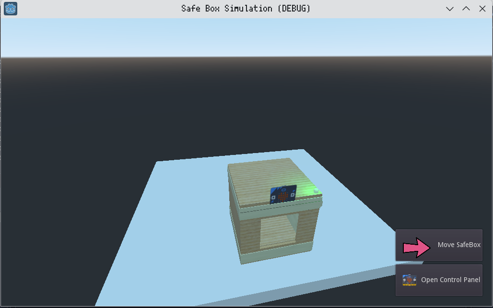

# Safe Box Simulation
A simulation of a physical safe-box built during my High School 10th grade, using the Godot Game
Engine.

# Motive
This project was part of a presentation during a High School project. Showcasing my groups
physical project virtually as backup if the physical version did not work. Since then. I have cleaned up the project's folder structure and code to make it easier to understand.

# Features
* Basic 3d model of the physical safe-box made in Blender.
* Simple Microbit emulator. (Signals for button presses, and a TileMap based LED display which can render any 5x5 frame.
* Some sounds and animations using AnimationPlayer and Audio nodes.

# Preview


# Usage
This project holds a fully contained Godot project. To run it, you will need the following:

* [Godot 3.x](https://godotengine.org/download/3.x/)

Once you have Godot installed, change your present working directory to the project's root directory and run the following commands to execute the [scenes/Main.tscn](scenes/Main.tscn) file:

```bash
godot
```

You may also open the Godot editor and import the project via the zip file or its [project.godot](project.godot) file.

# License
As with all other projects in this playground, the license is CC BY-NC.
