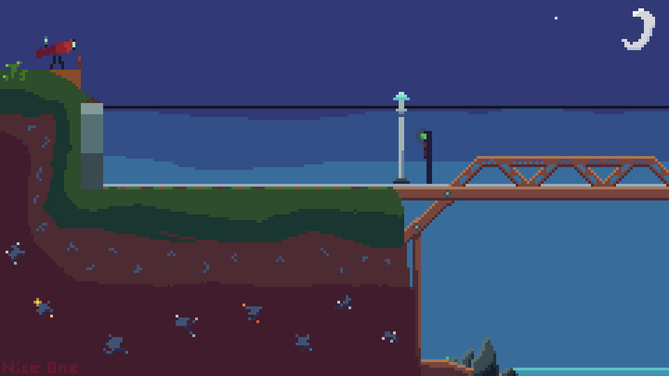

# Train Night Scene

A static procedural animation written in Julia using [Luxor.jl](https://github.com/JuliaGraphics/Luxor.jl).

# Motive

This project spurred from the curiosity of exploring procedural digit graphics. Previously, I had used [CMU graphics](https://academy.cs.cmu.edu/desktop) to create 2D vector graphics. However, I wanted to explore a more sophisticated and focued tool for the task, in this case Luxor.jl.

# Features

* Uses my custom animation package; [SimpleFrameAnimation.jl](https://github.com/The-Nice-One/PlaygroundProjects/tree/main/Libraries/SimpleFrameAnimation)
* Multiple animated sprites with different animation speeds and movement directions.
* Creates a animated `.gif` file.

# Artifacts

Whilst this project can be ran with Julia, the focus is on its artifacts. The following is the animated gif created by this project which was enlarged using [Gifsicle](https://github.com/kohler/gifsicle).



# Usage

This project contains a Julia project which can be ran given the following prerequisites are installed:

* [Julia](https://julialang.org/install/)

Once you have installed Julia, you can `cd` into the project directory and run the [src/main.jl](src/main.jl) file.

```bash
julia src/main.jl
```

# License

As with all other projects in this playground, the license is CC BY-NC.
